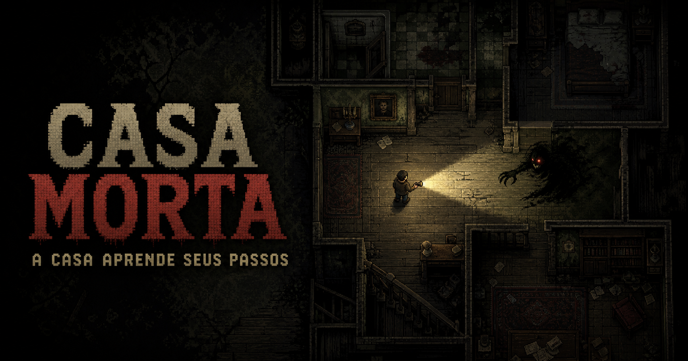

# Casa Morta

Jogo 2D de terror e sobrevivência, com visão superior inspirada em jogos como *Stardew Valley*. Você está preso em uma mansão e precisa sobreviver por **2 minutos e 30 segundos** enquanto uma criatura controlada por inteligência artificial observa seus hábitos e aprende suas rotas.



**Jogue gratuitamente:** [casa-morta.onrender.com](https://casa-morta.onrender.com/)

## Como funciona

- Explore uma mansão grande, dividida em 12 ambientes.
- Sobreviva durante 2 minutos e 30 segundos para vencer.
- A cada 20 segundos, o jogador produz um ruído involuntário que revela sua posição à criatura.
- A criatura memoriza as salas visitadas, as rotas repetidas e os esconderijos mais usados.
- A visão é limitada; a lanterna ilumina a direção apontada, mas consome carga.
- Existem 12 cargas de bateria espalhadas pela casa.
- Cada esconderijo pode ser usado por no máximo 8 segundos.
- Depois de sair ou ser expulso de um esconderijo, é necessário aguardar a recuperação do fôlego antes de se esconder novamente.
- Repetir o mesmo esconderijo aumenta a chance de a criatura procurá-lo naquele local.

## Controles

| Ação | Teclado e mouse |
| --- | --- |
| Mover | `W`, `A`, `S`, `D` ou setas |
| Correr | `Shift` |
| Apontar a lanterna | Mouse |
| Ligar ou desligar a lanterna | `F` |
| Entrar ou sair de um esconderijo | `E` |

Em dispositivos móveis, o jogo exibe controles de toque para movimentação, lanterna e interação.

## Conta e histórico de partidas

O jogador pode criar uma conta ou entrar com e-mail e senha. Quando está autenticado, cada partida é registrada no banco de dados Neon com informações como:

- resultado da partida;
- tempo de sobrevivência;
- cargas encontradas;
- quantidade de ruídos produzidos;
- tempo passado em esconderijos;
- tempo de uso da lanterna;
- número de salas visitadas.

A tela da conta mostra as oito sessões mais recentes, o número de sobrevivências e o melhor tempo. As políticas de segurança do banco restringem cada jogador aos próprios registros.

## Tecnologias

- React 19 e TypeScript;
- Canvas 2D para o jogo;
- Vinext para o aplicativo;
- Vite para a versão estática publicada no Render;
- Neon Serverless Postgres para autenticação e histórico;
- Render para hospedagem gratuita do site.

## Executar localmente

### Requisito

- Node.js `22.13.0` ou mais recente.

### Instalação

```bash
npm install
npm run dev
```

Abra o endereço local informado no terminal.

## Comandos disponíveis

| Comando | Finalidade |
| --- | --- |
| `npm run dev` | Inicia o ambiente local de desenvolvimento |
| `npm run build` | Gera e verifica a compilação com Vinext |
| `npm run build:render` | Gera a versão estática em `render-dist/` |
| `npm test` | Executa a compilação e os testes automatizados |
| `npm run lint` | Verifica a qualidade do código |
| `npm run db:generate` | Gera migrações do Drizzle quando o esquema for alterado |

## Publicação no Render

A configuração está declarada em [`render.yaml`](./render.yaml). Para um site estático no Render, use:

- **Comando de compilação:** `npm ci && npm run build:render`
- **Diretório de publicação:** `render-dist`

As atualizações enviadas para a ramificação conectada no GitHub podem ser publicadas pelo recurso de implantação automática do Render.

## Estrutura principal

| Caminho | Conteúdo |
| --- | --- |
| `app/page.tsx` | Regras, interface, desenho do mapa e inteligência da criatura |
| `app/globals.css` | Aparência e adaptação para diferentes tamanhos de tela |
| `lib/neon.ts` | Cliente de autenticação e acesso aos dados no Neon |
| `render/` | Ponto de entrada da versão estática usada no Render |
| `tests/` | Testes automatizados do conteúdo renderizado |
| `public/` | Imagens e ícones públicos |
| `render.yaml` | Configuração de hospedagem no Render |

## Desenvolvimento

O jogo continua em desenvolvimento. Novas melhorias podem ser feitas neste repositório e enviadas ao GitHub; depois, a versão hospedada pode receber a atualização por uma nova implantação no Render.
